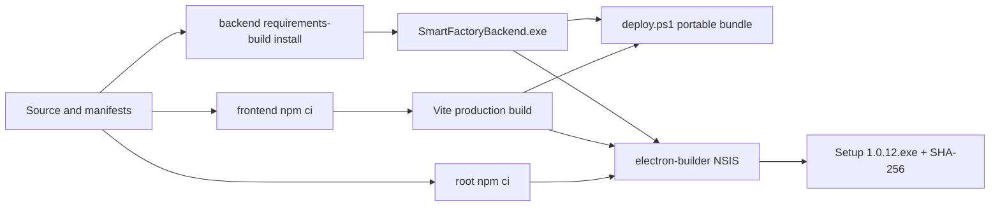

# Dependency Security Upgrade and NSIS Design

> Version: 1.0.0 | Date: 2026-07-12 | Status: Approved for implementation
> Level: Dynamic | Plan: docs/01-plan/features/dependency-security-upgrade-nsis.plan.md

---

## 1. Overview

### 1.1 Purpose

Define the exact dependency, release metadata, validation, and packaging changes
required to produce SmartFactoryLogger `1.0.12` without broad dependency churn.

### 1.2 Design Goals

- Change only explicitly approved direct dependency versions.
- Keep root and frontend npm locks deterministic.
- Convert the two selected Python security dependencies from floating inputs to
  exact build inputs.
- Preserve application runtime contracts while moving Electron to the smallest
  currently supported line.
- Treat PyInstaller, portable packaging, and NSIS generation as release gates.

## 2. Architecture

### 2.1 Build and Packaging Flow



### 2.2 Dependency Change Set

| Layer | Package | Current evidence | Target | Selection rule |
|-------|---------|------------------|--------|----------------|
| Frontend build | `vite` | lock `7.3.3` | `7.3.6` | Same minor security patch |
| Frontend test | `vitest` | lock `3.2.4` | `3.2.7` | Same minor security patch |
| Backend runtime | `python-multipart` | repo-local venv `0.0.22`; manifest floating | `0.0.32` exact | Parser security floor and reproducibility |
| Backend runtime | `Pillow` | repo-local venv `12.1.1`; manifest floating | `12.3.0` exact | Image security fixes and reproducibility |
| Desktop runtime | `electron` | lock `33.4.11` | `41.10.1` | Oldest supported stable line outside audited vulnerable range |
| Installer | `electron-builder` | lock `24.13.3` | `26.15.3` | npm audit direct remediation version |

No other direct dependency is intentionally changed. Transitive lockfile changes
are accepted only when required by these direct upgrades.

### 2.3 Runtime Contract

The application continues to use the existing Electron main/preload contract:

- `BrowserWindow`, `ipcMain`, `ipcRenderer`, and `contextBridge` APIs remain
  unchanged.
- `nodeIntegration` remains disabled and `contextIsolation` remains enabled.
- The backend executable remains an `extraResources` sidecar.
- The frontend remains a `file://` sidecar under `frontend/dist`.
- Backend startup, process cleanup, CSV/config data, and API behavior do not
  change.

## 3. Release Metadata

### 3.1 Version Invariant

The following values must all equal `1.0.12`:

- root `package.json.version`
- root `package-lock.json.version` and root package entry version
- frontend `package.json.version`
- frontend `package-lock.json.version` and root package entry version
- backend `backend/version.py::__version__`
- latest CHANGELOG heading

### 3.2 Artifact Contract

Expected primary artifact:

```text
dist/smart-factory-logger-v2 Setup 1.0.12.exe
```

Supporting artifacts:

- `backend/dist/SmartFactoryBackend.exe`
- `dist/SmartFactory_Portable/SmartFactory_v1.0.12.exe`
- `dist/SmartFactory_v1.0.12_Portable.zip`

Each final executable/ZIP must have size, modification time, and SHA-256 recorded
in the completion report.

## 4. Data and API Design

No persistent data model or HTTP API changes are introduced. Existing settings,
CSV schemas, sidecars, and endpoints remain byte-contract compatible. Dependency
changes that alter parser/decoder error behavior are internal implementation
details and must not change successful request/asset flows.

## 5. File Changes

| File | Planned change |
|------|----------------|
| `package.json` | Version `1.0.12`; Electron `^41.10.1`; electron-builder `^26.15.3`. |
| `package-lock.json` | Regenerate only from the approved root direct versions. |
| `frontend/package.json` | Version `1.0.12`; Vite `^7.3.6`; Vitest `^3.2.7`. |
| `frontend/package-lock.json` | Regenerate only from approved frontend direct versions. |
| `backend/requirements.txt` | Exact `python-multipart==0.0.32`, `Pillow==12.3.0`. |
| `backend/version.py` | Runtime/API/CSV metadata version `1.0.12`. |
| `CHANGELOG.md` | Add `1.0.12` security and packaging entry. |
| PDCA documents | Plan, design, Do, analysis, and completion evidence. |

The root NSIS configuration sets `warningsAsErrors: false` because
electron-builder 26.15.3's bundled `allowOnlyOneInstallerInstance.nsh` references
`IsPowerShellAvailable` from macros before the variable declaration macro is
expanded. NSIS warning 6000 is therefore expected. The build log remains a hard
review gate: any additional makensis warning is an unapproved failure.

No behavior-bearing application source is expected to change. The backend version
constant must change so `/health`, OpenAPI, and CSV metadata agree with the
installer version. If a build or test failure requires other source changes, stop
and document the newly discovered migration before editing runtime logic.

## 6. Implementation Order

1. Update release metadata and Python pins with a reviewable patch.
2. Run root `npm install --save-dev electron@41.10.1 electron-builder@26.15.3`
   to update the root lock.
3. Run frontend `npm install --save-dev vite@7.3.6 vitest@3.2.7` to update the
   frontend lock.
4. Inspect manifests and lockfiles to ensure no direct dependency drift.
5. Synchronize backend venv using `requirements-dev.txt` and
   `requirements-build.txt`.
6. Run `npm ci` in both npm projects, followed by audits and `npm run health`.
7. Run frontend production build.
8. Run `scripts/deploy.ps1`; require backend EXE and portable ZIP success.
9. Run `npm run dist`; require NSIS success.
10. Inspect artifacts, calculate hashes, run packaged startup smoke if safe, and
    compare implementation against this design.

## 7. Test Plan

### 7.1 Dependency Verification

- `npm ls electron electron-builder --depth=0`
- `npm --prefix frontend ls vite vitest --depth=0`
- backend Python imports and `importlib.metadata.version(...)`
- `pip check`
- inspect direct manifest and lock versions with Node scripts

### 7.2 Repository Health

- `npm run health`
- Confirm frontend typecheck, ESLint, 182-test baseline or better.
- Confirm backend Ruff, mypy, and 471-test baseline or better.
- `npm --prefix frontend run build`

### 7.3 Security Verification

- Root and frontend `npm audit --json` before/after comparison.
- Confirm selected direct vulnerable versions are absent.
- Do not require a fully clean frontend audit because unresolved Grafana
  transitive advisories are outside this change and may have no compatible direct
  fix.

### 7.4 Packaging Verification

- Clean PyInstaller build through `scripts/deploy.ps1`.
- Confirm backend EXE, frontend sidecar, required static assets, portable ZIP.
- Run `npm run dist` and confirm the NSIS filename/version.
- Capture the full makensis output and confirm the only warning is warning 6000
  for `IsPowerShellAvailable`.
- Inspect ASAR or unpacked application contents for `main.js`, `preload.js`, and
  `tree-kill`; ensure build-only packages are not runtime dependencies.
- Calculate SHA-256 for the backend EXE, portable ZIP, and NSIS installer.

### 7.5 Packaged Startup Smoke

- Launch the generated unpacked or installed executable only after packaging
  succeeds.
- Require Electron window startup, backend process creation, dashboard file load,
  preload IPC, and clean backend termination.
- If full installer execution requires interactive elevation, record that as an
  unexecuted operational test rather than claiming success.

## 8. Security Considerations

- Preserve Electron renderer isolation settings.
- Treat electron-builder vulnerabilities as build-machine/supply-chain risks even
  when not included in the shipped ASAR.
- Avoid `npm audit fix --force`, package overrides, and unrelated upgrades.
- Do not patch files under `node_modules`; use electron-builder's documented
  `nsis.warningsAsErrors` configuration and explicit warning review.
- Python exact pins prevent a clean build from silently selecting a different
  parser or native image decoder.
- Generated installers remain unsigned unless an existing signing configuration
  is detected; do not fabricate signing evidence.

## 9. Operations and Rollback

- Store the new installer alongside, not over, the `1.0.11` artifact.
- Roll back by redeploying the last verified installer and reverting all manifest
  and lockfile changes together.
- No database or user-data rollback is required.
- Compare local Electron startup logs and backend health evidence before release.
