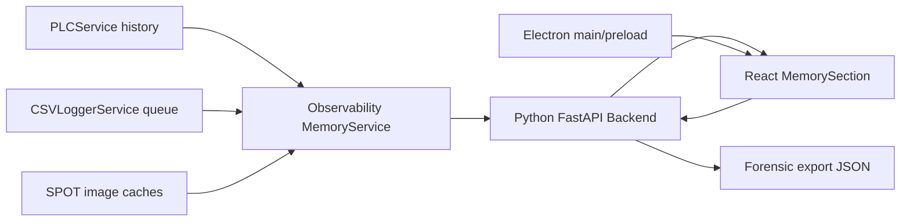

# Memory Diagnostics Hardening Design

## 1. Summary

이 설계는 메모리 진단 기능을 운영 안전성 중심으로 확장한다. 핵심 원칙은 collector 실행을 격리하고, resident buffer 후보를 bounded 방식으로 계측하며, size/delta를 severity와 leak suspicion으로 변환하고, 마지막에 export와 tests로 회귀를 막는 것이다.

런타임 변경은 후속 PR에서 additive 방식으로 적용한다. 기존 `/api/memory/state`, `/api/memory/details`, profiler endpoint, export endpoint의 기존 소비자는 깨지지 않아야 한다.

## 2. Architecture



Design constraints:

- Collector는 read-only여야 한다.
- Hot path에서는 bounded sampling만 허용한다.
- Lock 보유 중 recursive size estimate를 수행하지 않는다.
- Hard timeout으로 Python thread를 강제 중단하지 않는다.
- Export에는 redaction을 적용한다.
- Electron renderer에는 제한된 preload API만 노출한다.

## 3. Data Contracts

### 3.1 Memory Collector Item

Backend collector normalize result는 다음 additive fields를 포함한다.

```text
name: string
kind: string
bytes: number
items: number | null
note: string | null
exactness: exact | observed | estimated | estimated-enumerated | unavailable
latency_ms: number | null
status: ok | slow | error | stale
last_ok_at: ISO timestamp | null
last_error_at: ISO timestamp | null
error_count: number
stale: boolean
source: backend | frontend | electron
severity: ok | warn | critical
severity_reasons: string[]
budget: object | null
```

기존 필드는 유지한다. 새 UI는 unknown field에 의존하지 않고 optional로 렌더링한다.

### 3.2 Collector Runtime State

`MemoryService`는 collector별 상태를 별도 dict로 가진다.

```python
self._collector_runtime_state: dict[str, dict[str, Any]] = {}
self._collector_latency_warn_ms = 250.0
self._collector_stale_after_sec = 60.0
```

상태는 `last_ok_at`, `last_error_at`, `error_count`, `last_latency_ms`, `last_status`, `last_value`를 보관한다. 느린 collector는 `status=slow`로 표시하고, 다음 샘플에서 필요 시 이전 값을 `status=stale`로 재사용할 수 있게 설계한다.

### 3.3 PLC History Summary

`PLCService.get_history_memory_summary(sample_size=128)`는 lock 안에서 count, bounds, bounded sample copy만 수행한다. `estimate_size_bytes()`는 lock 밖에서 실행한다.

Required fields:

- `count`
- `max_samples`
- `oldest_timestamp_ms`
- `newest_timestamp_ms`
- `sample_size`
- `sampled_bytes`
- `estimated_bytes`
- `avg_bytes_per_sample`
- `fill_ratio`

Collector name은 `facility.plc_history`다.

### 3.4 CSV Logger Runtime Summary

`CSVLoggerService`는 enqueue/write/drop runtime counters를 유지한다.

Required fields:

- `queue_size`
- `queue_maxsize`
- `queue_ratio`
- `drop_count`
- `last_drop_at`
- `last_enqueue_at`
- `last_write_at`
- `writer_lag_sec`
- `payload_bytes_ema`
- `estimated_queue_bytes`
- `buffer_size`
- `auto_save`

Collector name은 `facility.csv_logger`를 유지한다. bytes는 `estimated_queue_bytes + runtime mapping overhead`로 계산한다.

### 3.5 SPOT Image Cache Summary

`spot_api.py`는 private cache dict를 app layer가 직접 읽지 않도록 public summary function을 제공한다.

Required fields:

- `image_bytes`
- `image_age_sec`
- `image_cache_state`
- `image_failure_count`
- `image_next_retry_at`
- `live_image_bytes`
- `live_image_age_sec`
- `live_image_url_present`
- `live_image_failure_count`
- `live_image_next_retry_at`
- `total_bytes`

Collector는 `spot.image_cache`, `spot.live_cache`로 분리한다. URL 원문은 export/UI에 저장하지 않고 presence 또는 host redacted 형태만 허용한다.

### 3.6 Leak Suspect

`/api/memory/details`에 다음 field를 추가한다.

```json
{
  "leak_suspects": [
    {
      "name": "facility.plc_history",
      "slope_bytes_per_min": 12345678,
      "monotonic_ratio": 0.91,
      "window_sec": 900,
      "severity": "warn",
      "reason": "steady_growth"
    }
  ]
}
```

용어는 `leak_suspect`로 제한한다. GC retention 검증 전에는 leak 확정으로 표시하지 않는다.

### 3.7 Electron Memory Snapshot

Electron main process는 IPC handler 하나만 제공한다.

```text
channel: sfl:get-electron-memory
return:
  capturedAt: epoch milliseconds
  pid: number
  type: string
  currentProcess: ProcessMemoryInfo
  heap: V8 heap statistics | null
  appMetrics: ProcessMetric[]
```

Electron 공식 문서 기준 `app.getAppMetrics()`는 앱 관련 process들의 memory/CPU statistics를 반환한다. `process.getProcessMemoryInfo()`는 현재 process memory statistics를 KB 단위로 반환하며 app ready 이후 호출해야 한다.

## 4. Backend Design

### 4.1 Collector Safety Contract

`backend/Observability/memory_service.py`:

- `_run_collectors()`에서 `time.perf_counter()`로 latency를 측정한다.
- collector 예외는 개별 error item으로 격리한다.
- `self._collector_runtime_state`를 갱신한다.
- `_normalize_collector_result()`는 새 optional fields를 채운다.
- stale 판단은 `now - last_ok_at >= self._collector_stale_after_sec`로 시작한다.
- slow 판단은 `latency_ms >= self._collector_latency_warn_ms`로 시작한다.

Hard timeout은 구현하지 않는다. Python worker thread를 안전하게 중단하기 어렵고, 진단 코드가 복잡해져 운영 리스크가 커진다.

### 4.2 PLC History Collector

`backend/FacilityData/service.py`:

- `PLCService.get_history_memory_summary(sample_size: int = 128)` 추가
- `history_lock` 안에서는 bounded sample copy까지만 수행
- size estimate는 lock 밖에서 수행

`backend/app.py`:

- `_collect_plc_history()` 추가
- `_register_memory_collectors()`에 `facility.plc_history` 등록

### 4.3 CSV Logger Collector

`backend/FacilityData/repository.py`:

- `_drop_count`
- `_last_drop_at`
- `_last_enqueue_at`
- `_last_write_at`
- `_payload_bytes_ema`
- `_runtime_lock`

`enqueue()`는 payload size EMA와 drop count를 기록한다. writer loop는 flush 완료 시 `last_write_at`을 갱신한다.

`backend/app.py`:

- `_collect_csv_logger()`는 `estimated_queue_bytes`를 bytes 기준으로 사용한다.
- note는 `queue=.../... drop=... lag=...s` 형태로 유지한다.

### 4.4 SPOT Cache Collectors

`backend/FacilityData/drivers/spot_api.py`:

- `get_image_cache_memory_summary()` 추가
- private cache dict 직접 접근 제거
- live URL은 원문 저장 대신 present/redacted 형태로만 반환

`backend/app.py`:

- 기존 `spot.cache`는 deprecate 하거나 compatibility alias로 유지한다.
- 신규 `spot.image_cache`, `spot.live_cache`를 등록한다.

### 4.5 Budget And Severity

`MemoryService`는 default budget table을 갖는다. 초기값은 보수적으로 시작하고 설정화는 후속 iteration에서 다룬다.

```python
DEFAULT_MEMORY_BUDGETS = {
    "facility.plc_history": {
        "warn_bytes": 150 * 1024 * 1024,
        "critical_bytes": 300 * 1024 * 1024,
        "warn_growth_per_min": 32 * 1024 * 1024,
    },
    "facility.csv_logger": {
        "warn_items_ratio": 0.70,
        "critical_items_ratio": 0.90,
        "warn_growth_per_min": 16 * 1024 * 1024,
    },
    "spot.live_cache": {
        "warn_bytes": 10 * 1024 * 1024,
        "critical_bytes": 50 * 1024 * 1024,
    },
}
```

Severity order는 `critical > warn > ok`다. `status=error`는 severity와 별도 축으로 UI에 노출한다.

### 4.6 Slope Leak Detector

Process history와 collector history를 이용해 rolling slope를 계산한다.

- 최소 샘플 수: 4
- 기본 window: 15분 또는 available history
- process fields: `rss_bytes`, `uss_bytes`, `private_bytes`
- collector field: `bytes`
- suspect 조건:
  - `slope_bytes_per_min >= warn_growth_per_min`
  - `monotonic_ratio >= 0.75`
  - `latest_bytes >= baseline_bytes * 1.20`

결과는 `self._latest_leak_suspects`에 저장하고 details/export에 포함한다.

### 4.7 GC Snapshot

`MemoryService.capture_gc_snapshot()`:

- before process sample capture
- manual `gc.collect(0)`, `gc.collect(1)`, `gc.collect(2)`
- latency 측정
- after process sample capture
- rss/uss/private delta 계산
- `self._last_gc_snapshot` 저장

`backend/app.py`:

- `POST /api/memory/gc` 추가
- 실패 시 500과 error log

자동 sampler에서는 GC를 호출하지 않는다.

### 4.8 Export Schema V2

`build_export_payload()`는 schema v2를 반환한다.

Required top-level fields:

- `schema_version: "memory-export-v2"`
- `generated_at`
- `runtime`
- `summary_state`
- `details_state`
- `frontend`
- `analysis`
- `redaction`

`analysis`에는 budget results, leak suspects, collector runtime state, last GC snapshot, profiler state를 포함한다.

Redaction은 recursive key-based 방식으로 적용한다. `password`, `token`, `secret`, `authorization`, `api_key` 계열 key는 value를 저장하지 않는다.

## 5. Frontend And Electron Design

### 5.1 MemorySection UI

`frontend/src/domains/Configuration/components/SettingsModal/MemorySection.tsx`:

- Backend growth table에 `severity`, `status`, `latency`, `stale` 표시
- 기본 정렬: severity order, `delta_bytes`, `bytes`
- leak suspects section 추가
- GC comparison button과 result panel 추가
- Electron process memory section 추가
- exactness badge는 `observed`, `estimated`, `estimated-enumerated`, `unavailable`을 구분

설정 화면 내 운영 진단 패널 구조는 유지한다. 별도 landing page나 marketing style 화면은 만들지 않는다.

### 5.2 Frontend Exactness

`frontend/src/shared/types.ts`:

```ts
export type MemoryExactness =
  | 'exact'
  | 'observed'
  | 'estimated'
  | 'estimated-enumerated'
  | 'unavailable';
```

`useMemoryViewModel.ts`:

- browser memory API result는 `observed`
- storage enumeration은 `estimated-enumerated`
- app structure heuristic은 `estimated`
- unsupported browser memory는 `unavailable`
- alert severity 계산에서 low-confidence estimated 항목은 별도 reason을 붙인다.

### 5.3 Electron IPC

`main.js`:

- `ipcMain` import
- `BrowserWindow.webPreferences.preload` 설정
- `ipcMain.handle('sfl:get-electron-memory', ...)` 추가

`preload.js`:

- `contextBridge.exposeInMainWorld('smartFactoryElectron', { getMemory })`
- arbitrary channel invoke는 노출하지 않는다.

`package.json`:

- Electron build files에 `preload.js` 포함 여부 확인

## 6. Security Design

- Export는 redaction 후 저장한다.
- SPOT live URL 원문은 UI/export에 저장하지 않는다.
- Electron preload는 memory read API 하나만 제공한다.
- Backend GC endpoint는 mutation endpoint지만 운영 진단 목적이다. CSRF/authorization 체계가 없는 현재 구조에서는 기존 local app threat model 안에서만 노출하고, 외부 네트워크 공개 금지를 문서화한다.
- Collector는 config, PLC, SPOT 상태를 변경하지 않는다.
- Error detail은 user-facing API에 raw exception repr을 과도하게 노출하지 않는다.

## 7. Validation Plan

Backend tests:

- `test_memory_collector_exception_does_not_break_sampler`
- `test_memory_collector_latency_is_recorded`
- `test_plc_history_collector_estimates_without_holding_lock`
- `test_csv_logger_drop_count_increments_on_full_queue`
- `test_spot_live_cache_collector_reports_live_bytes`
- `test_budget_severity_warn_and_critical`
- `test_leak_slope_detects_monotonic_growth`
- `test_gc_snapshot_returns_before_after_delta`
- `test_profiler_start_stop_idempotent`
- `test_export_payload_schema_v2_contains_runtime_and_analysis`

Frontend tests:

- `useMemoryViewModel marks unsupported browser memory as unavailable`
- `useMemoryViewModel sets exactness for storage collectors`
- `MemorySection sorts critical severity before size`
- `MemorySection renders Electron process metrics if present`
- `MemorySection renders leak suspects and GC delta`

Checks:

- `npm run health`
- backend unittest targeted memory suite
- frontend typecheck
- frontend test suite
- `git diff --check`

## 8. Compatibility

- Existing API fields remain.
- New response fields are additive.
- Existing `spot.cache` can remain temporarily as compatibility alias, but UI should prefer `spot.image_cache` and `spot.live_cache`.
- Export schema v1 readers may ignore v2 payload if they are strict. For this repo, export is diagnostic artifact, so v2 can be introduced with `schema_version` and no runtime migration.

## 9. Rollback

- PR 1 rollback: unregister new collectors and revert MemoryService contract extension.
- PR 2 rollback: disable severity/leak/GC UI paths while retaining raw collector values.
- PR 3 rollback: remove preload IPC exposure and fall back to backend/frontend-only export.

No DB rollback is required. CSV data files and PLC history persistence are not changed.

## 10. Pre-Implementation Server Evidence

The first server-side evidence package is an idle/non-production baseline, not a production memory-growth proof.

Artifact:

- `sfl-memory-precheck-idle-baseline-20260628.sanitized.zip`

Captured facts:

- Collection window: 2026-06-28 00:26:49 to 00:30:49 KST
- Process samples: 60 rows
- Backend memory snapshot:
  - RSS: about 277.4 MB
  - USS: about 224.8 MB
  - private: about 239.3 MB
  - threads: 20
  - handles: 427
  - open files: 9
- Existing collector count: 6
- Existing collector names:
  - `observability.requests`
  - `observability.errors`
  - `spot.cache`
  - `facility.plc_state`
  - `configuration.snapshot`
  - `facility.csv_logger`
- Existing `facility.csv_logger` state: `queue=0 buffer=0`
- SPOT live smoke: HTTP 200, `image/jpeg`, about 9 KB response
- Existing memory export succeeded.

Design implications:

- PR 1 can proceed without requiring production equipment access because collector safety, PLC history summary shape, CSV runtime counters, and unit tests can be implemented locally.
- PR 2 still needs production or production-like evidence before finalizing severity and slope thresholds.
- PR 3 must validate packaged Electron process separation and export v2 redaction against a packaged build.
- The current export schema is confirmed to be pre-v2: it includes summary/details/frontend, but no `schema_version`, `runtime`, or `analysis` block.
- The idle baseline is useful for regression comparison, but not for leak classification.

## 11. Ranked Micro-PDCA Design Boundary

This design is the parent architecture. Actual implementation is split into 11 dedicated PDCA features, one per priority rank.

The child features are:

- `memory-diagnostics-r01-collector-contract`
- `memory-diagnostics-r02-plc-history`
- `memory-diagnostics-r03-csv-logger-runtime`
- `memory-diagnostics-r04-spot-cache`
- `memory-diagnostics-r05-budget-severity`
- `memory-diagnostics-r06-leak-slope`
- `memory-diagnostics-r07-gc-snapshot`
- `memory-diagnostics-r08-electron-memory`
- `memory-diagnostics-r09-frontend-exactness`
- `memory-diagnostics-r10-export-v2`
- `memory-diagnostics-r11-tests-ci`

For bkit analyze, each child design document is the immediate source of truth. This parent design is used only for shared architecture, shared evidence, and cross-rank consistency.
