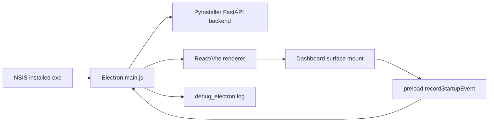

# NSIS Startup Render Performance Design

> Version: 1.0.0 | Date: 2026-07-04 | Status: Implemented - baseline collected
> Level: Dynamic | Plan: docs/01-plan/features/nsis-startup-render-performance.plan.md

---

## 1. Overview

### 1.1 Purpose

Add local, package-safe startup telemetry that measures the installed NSIS app
from Electron process start to the first usable dashboard render.

### 1.2 Design Goals

- Produce one local Electron log timeline with monotonic elapsed milliseconds.
- Avoid external telemetry and avoid exposing arbitrary Electron IPC.
- Keep browser development mode safe when the Electron bridge is unavailable.
- Make the final render event deterministic enough for repeated cold-start
  baseline runs.

## 2. Architecture

### 2.1 System Architecture



### 2.2 Component Design

| Component | Responsibility |
|-----------|----------------|
| `main.js` | Owns startup clock, validates startup events, logs milestones. |
| `preload.js` | Exposes constrained bridge methods under `smartFactoryElectron`. |
| `frontend/src/shared/types.ts` | Types the Electron bridge contract. |
| `frontend/src/shared/startup/startupTelemetry.ts` | Handles renderer fallback, dedupe, after-paint scheduling, and a bounded timeout fallback. |
| `NativeDashboardSurface.tsx` | Emits ready event for normal dashboard mode. |
| `DashboardSceneSurface.tsx` | Emits ready event for layout-editing scene mode. |
| `backend/tests/test_data_history_api.py` | Guards preload/main IPC contract. |
| `scripts/measure_nsis_startup_render.ps1` | Launches installed exe, extracts dashboard-ready elapsed time, and cleans up the launched process tree by default. |

### 2.3 Data Flow

1. `main.js` initializes `startupOriginNs` immediately after imports and logs
   `electron.process-start`.
2. Electron lifecycle events log elapsed time through a shared
   `logStartupEvent(name, payload)` helper.
3. React dashboard surfaces call `window.smartFactoryElectron?.recordStartupEvent`
   after mount and two `requestAnimationFrame` callbacks. If animation frames are
   throttled, a bounded timeout fallback records the ready event.
4. `main.js` validates the event name and payload shape before logging
   `renderer.dashboard-ready`.
5. Measurement scripts or operators read `debug_electron.log` and compute the
   delta between `electron.process-start` and `renderer.dashboard-ready`.

## 3. Data Model

### 3.1 Startup Log Event

```ts
type StartupEventPayload = Record<string, string | number | boolean | null>;

type StartupLogEvent = {
  event: string;
  elapsed_ms: number;
  payload?: StartupEventPayload;
};
```

### 3.2 Allowed Renderer Events

Renderer-originated startup events are limited to:

- `renderer.index-boot`
- `renderer.index-render`
- `renderer.dashboard-ready`

Payloads are bounded to a small object with primitive values only. Invalid or
unexpected renderer events are logged as rejected events and ignored for timing.

## 4. API Specification

### 4.1 Electron Preload Bridge

```ts
interface SmartFactoryElectronBridge {
  getMemory: () => Promise<ElectronMemorySnapshot>;
  recordStartupEvent: (
    name: SmartFactoryStartupEventName,
    payload?: SmartFactoryStartupEventPayload
  ) => Promise<{ ok: boolean }>;
}
```

### 4.2 IPC Channels

| Channel | Direction | Purpose |
|---------|-----------|---------|
| `sfl:get-electron-memory` | renderer invoke -> main | Existing memory snapshot. |
| `sfl:record-startup-event` | renderer invoke -> main | New constrained startup telemetry. |

No `ipcRenderer.send`, listener registration, arbitrary channel forwarding, or
variadic argument passthrough is allowed.

## 5. Implementation Plan

### 5.1 File Structure

- `main.js`
- `preload.js`
- `frontend/src/shared/types.ts`
- `frontend/src/shared/startup/startupTelemetry.ts`
- `frontend/src/shared/startup/startupTelemetry.test.ts`
- `frontend/src/index.tsx`
- `frontend/src/scenes/NativeDashboardSurface.tsx`
- `frontend/src/scenes/DashboardSceneSurface.tsx`
- `frontend/src/domains/Observability/hooks/useMemoryViewModel.test.ts`
- `backend/tests/test_data_history_api.py`
- `scripts/measure_nsis_startup_render.ps1`

### 5.2 Implementation Order

1. Add startup event helper, validation, and Electron lifecycle logging in
   `main.js`.
2. Extend `preload.js` with `recordStartupEvent`.
3. Extend shared TypeScript bridge types.
4. Emit index boot/render and dashboard-ready events from the renderer.
5. Update contract/unit tests.
6. Run focused typecheck and test commands.

## 6. Test Plan

### 6.1 Unit Tests

- Preload exposes exactly two constrained `ipcRenderer.invoke` calls.
- Main registers both memory and startup IPC handlers.
- Browser mode returns safely when `smartFactoryElectron` is absent.
- `readElectronMemorySnapshot` still invokes only `getMemory`.

### 6.2 Manual / Packaged Validation

After a new NSIS build:

1. Install the generated setup artifact.
2. Close existing SmartFactory processes.
3. Run `powershell -ExecutionPolicy Bypass -File scripts\measure_nsis_startup_render.ps1 -ExePath <installed exe>`.
4. Inspect the returned JSON and Electron `debug_electron.log` if the script times out.
5. Record `renderer.dashboard-ready elapsed_ms` and the `cleanup` result.
6. Use `-KeepRunning` only when manual observation requires leaving the app open.
7. Repeat enough cold starts to establish median and p95.

## 7. Security Considerations

- Keep `contextIsolation: true` and `nodeIntegration: false`.
- Validate renderer-originated event names in the main process.
- Accept only primitive payload fields and cap string length.
- Do not expose filesystem, process, shell, or arbitrary IPC access to renderer.
- Do not log secrets, URLs with credentials, or machine-specific private data in
  startup payloads.

## 8. Operations

- Rollback is a code revert of the telemetry bridge and event calls.
- Observability impact is local-only log growth. Each startup adds a bounded
  number of lines.
- Migration risk is none; no persistent schema or data files change.
- Failure mode: if renderer IPC fails, startup continues and logs only main
  lifecycle events.
