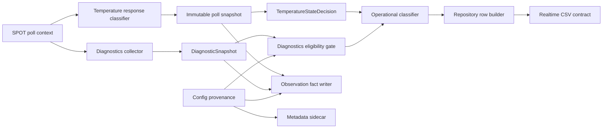

# SPOT Temperature v2.4 Operational Hardening - Design

> Version: 1.0.0 | Date: 2026-07-10 | Status: Completed
> Level: Dynamic | Baseline: `master@07dd370e22e8bf2c413c4afdc4cf85a30d54d031`
> Plan: `docs/01-plan/features/spot-temperature-v2-4-operational-hardening.plan.md`
> Implementation authorization: Not granted by this document

---

## 1. Overview

### 1.1 Purpose

이 설계는 SPOT Temperature 운영 경로의 7개 계약 결함을 단계적으로 수정하기 위한 구현 계약을 고정한다. State decision과 최종 CSV의 cache fallback 의미를 일치시키고, 검증되지 않았거나 현재 poll에 결합되지 않은 diagnostics가 물리 원인 후보로 승격되지 않도록 한다. 기존 v2.3/v2.4 파일과 observation fact는 읽기 호환성을 유지한다.

### 1.2 Baseline Findings

- `temperature_state.py`는 TTL-valid transport fallback을 `ok/reused/cached_observation`으로 허용한다.
- `temperature_operational.py`는 cached origin보다 transport error를 먼저 판정한다.
- `spot_low_signal.py`는 `low_signal_comparator_verified`를 입력받지 않는다.
- 현재 diagnostics는 8개 GET의 일부만 성공해도 `async_enriched`이며 이전 poll snapshot을 age window 안에서 재사용한다.
- Config snapshot은 로컬 값을 복사하며 operator verified 기본값이 true이다.
- 일부 cause enum은 runtime producer가 없다.
- Repository는 operational 판정 전에 legacy Temperature quality를 확정한다.
- Observation row age는 monotonic이지만 value age는 explicit/wall-clock 경로를 사용한다.

### 1.3 Fixed Design Decisions

| ID | Decision | Rationale |
|---|---|---|
| DEC-01 | Transport cache fallback은 정책 A를 적용한다. | 기존 state decision과 TTL/suppression 구현을 보존한다. |
| DEC-02 | Numeric Low Signal은 effective comparator verification이 true일 때만 causal evidence다. | 미검증 `<`/`<=` 오판을 fail-closed 한다. |
| DEC-03 | Diagnostics 원인 승격은 same-poll binding, bounded age, required field 성공을 모두 요구한다. | 단순 max-age만으로 이전 poll 오판을 막을 수 없다. |
| DEC-04 | Atomic `/output` JSON은 capability evidence가 있을 때만 활성화한다. 기본은 `async_fact_only`다. | 장비 API를 추정하지 않는다. |
| DEC-05 | Config operator verification 기본값은 false이며 attested fingerprint가 일치해야 true가 된다. | 신규 배포 및 drift를 자동 fail-closed 한다. |
| DEC-06 | Collector가 없는 cause enum은 유지하되 promotion을 차단한다. | schema 호환성을 지키면서 허위 후보를 제거한다. |
| DEC-07 | Legacy quality 정합화와 새 value-age clock status는 realtime schema `2.5.0`에서 원자적으로 활성화한다. | 기존 `2.4.0` 의미와 header를 변경하지 않는다. |
| DEC-08 | Observation fact는 `1.3.0`으로 bump하고 기존 `1.2.1` 읽기 검증을 유지한다. | diagnostics provenance를 행 단위로 감사한다. |

## 2. Architecture

### 2.1 Target Data Flow



### 2.2 Component Responsibilities

| Component | Responsibility | Must not do |
|---|---|---|
| `temperature_state.py` | Transport, source freshness, cache availability와 origin 결정 | CSV quality 또는 cause 판정 |
| `temperature_operational.py` | Row freshness, sentinel precedence, operational status와 eligible cause 계산 | Cache availability 재계산 |
| `spot_low_signal.py` | Pure low-signal evidence 계산 | Config 또는 diagnostics를 직접 조회 |
| `drivers/spot_api.py` | Poll context, immutable snapshot, diagnostics collection/binding, monotonic timestamps | Unbound diagnostics를 current poll처럼 표시 |
| `drivers/real_plc.py` | Snapshot metadata를 FactoryData로 무손실 전달 | 필드 의미 재분류 |
| `spot_config_provenance.py` | Canonical config, fingerprint, effective verification 계산 | Secret 원문을 metadata에 기록 |
| `repository.py` | Row build 시 age 재계산, schema contract 선택, 최종 invariant 적용 | Snapshot-provided effective age를 신뢰 |
| `spot_observation_fact.py` | Raw diagnostics와 evidence provenance의 authoritative fact | Realtime CSV raw diagnostics 중복 |
| `validate_csv_v2_shadow.py` | Writer와 독립적으로 schema 및 cross-field invariant 검증 | Production helper를 호출해 동일 결함 공유 |

### 2.3 Global Invariants

1. `Temperature`가 finite이면 `temperature_output_status=valid`이고 origin은 current 또는 cached이다.
2. `temperature_output_status!=valid`이면 realtime `Temperature`는 blank이다.
3. Cached origin은 `TemperatureStateDecision`이 `OK/REUSED/CACHED_OBSERVATION`일 때만 허용한다.
4. Invalid sentinel 이후 새 valid poll 전까지 cached origin은 금지한다.
5. Cause candidate는 eligible direct evidence와 provenance 없이는 `unknown`이다.
6. 모든 age는 finite non-negative 또는 blank이다.
7. `clock_anomaly`이면 대응 age는 blank이다.
8. 하나의 realtime CSV 파일은 하나의 schema version, header, quality semantics만 가진다.
9. Observation fact evidence code는 required raw/config source가 같은 행에 존재해야 한다.
10. Config drift 또는 verification metadata 손상은 candidate를 낮추는 방향으로 실패한다.

## 3. Cache Fallback Contract

### 3.1 Authoritative Origin

`TemperatureStateDecision.temperature_value_origin`을 최종 origin의 단일 source of truth로 사용한다. `TemperatureOperationalInput.temperature_value_origin`은 호환 입력으로 남기되 state decision과 다르면 `origin_decision_mismatch` counter를 올리고 effective origin을 `none`으로 fail-closed 한다.

### 3.2 Exact Precedence Table

위에서 먼저 일치한 행을 반환한다.

| Order | Condition | Output status | Reason | Temperature/origin |
|---:|---|---|---|---|
| 1 | first poll 미완료 또는 `not_attempted` | `startup_pending` | `startup_pending` | blank/none |
| 2 | row-age clock anomaly | `unknown` | `unknown_freshness` | blank/none |
| 3 | row freshness stale 또는 source freshness stale | `stale` | `stale_observation` | blank/none |
| 4 | device status `temperature_under_range` | `under_range` | `under_range` | blank/none |
| 5 | device status `temperature_over_range` | `over_range` | `over_range` | blank/none |
| 6 | state decision `OK/REUSED/CACHED_OBSERVATION`, row fresh, fallback allowed | `valid` | blank | cached value/cached_observation |
| 7 | timeout | `source_error` | `timeout` | blank/none |
| 8 | connection error | `source_error` | `connection_error` | blank/none |
| 9 | HTTP error | `source_error` | `http_error` | blank/none |
| 10 | config missing | `source_error` | `config_missing` | blank/none |
| 11 | parse error 또는 empty body | `source_error` | `parse_error` 또는 `empty_body` | blank/none |
| 12 | numeric out of range | `source_error` | `numeric_out_of_range` | blank/none |
| 13 | state decision current observation | `valid` | blank | current value/current_observation |
| 14 | raw not received | `unknown` | `not_attempted` | blank/none |
| 15 | row freshness unknown | `unknown` | `unknown_freshness` | blank/none |
| 16 | 그 외 | `unknown` | `unknown` | blank/none |

Cached-valid은 stale/sentinel보다 앞서지 않는다. Poll completion age와 source freshness가 동일 monotonic 기준을 사용하므로 freshness threshold를 넘은 cache는 TTL이 남아 있어도 operational output에서 stale이다.

### 3.3 Cached Fallback Predicate

```python
def is_accepted_cached_fallback(state_decision, input_state, row_freshness):
    return (
        state_decision.temperature_status_shadow == TemperatureStatusShadow.OK
        and state_decision.spot_cache_status == SpotCacheStatus.REUSED
        and state_decision.temperature_value_origin == TemperatureValueOrigin.CACHED_OBSERVATION
        and input_state.cache_fallback_allowed is True
        and input_state.has_ttl_valid_cache is True
        and row_freshness == "fresh"
    )
```

Repository는 accepted predicate 결과가 valid일 때만 effective cached temperature를 보존한다. Invalid sentinel suppression은 driver가 `cache_fallback_allowed=false`로 만들고 classifier도 이를 재검증한다.

## 4. Diagnostics Collection and Binding

### 4.1 PollContext

Temperature와 diagnostics가 같은 poll identity를 공유하도록 immutable context를 만든다.

```python
@dataclass(frozen=True)
class SpotPollContext:
    service_instance_id: str
    poll_seq: int
    started_at_epoch: float
    started_monotonic: float
```

`_begin_spot_temperature_poll()`의 sequence 예약을 poll context 생성으로 이동한다. Temperature request와 async diagnostics task는 같은 context를 입력받는다.

### 4.2 DiagnosticSnapshot

```python
@dataclass(frozen=True)
class DiagnosticSnapshot:
    snapshot_id: str
    source_poll_seq: int | None
    captured_at: str
    captured_monotonic: float | None
    capture_status: str
    source: str
    values: Mapping[str, object]
    field_status: Mapping[str, str]
    missing_fields: tuple[str, ...]
```

`snapshot_id` 형식은 `<service_instance_id>:diag:<diagnostics_seq>`이다. `field_status` 값은 `success`, `missing`, `http_error`, `timeout`, `parse_error`, `not_requested`로 제한한다.

### 4.3 Collection Modes

| Mode | Default | Behavior | Causal use |
|---|---:|---|---|
| `async_fact_only` | true | 기존 parameter GET을 non-blocking으로 수집하고 fact에 기록 | 금지. 감사 자료 전용 |
| `async_same_poll` | false | 같은 PollContext로 parameter GET을 병렬 실행 | same-poll binding과 required field 성공 시 허용 |
| `atomic_output_json` | false | 검증된 전체 `/output` JSON 한 번으로 temperature와 diagnostics 파싱 | `same_response`이면 허용 |

`atomic_output_json`은 sanitized 장비 capture 또는 공식 장비 계약으로 다음을 검증한 뒤에만 enable한다.

- Response가 JSON object이다.
- `temperature`가 존재하고 기존 sentinel/raw classification을 동일하게 적용할 수 있다.
- `alarmstatus`, `signalpc` 등 diagnostics 값의 타입과 단위가 확인됐다.
- 인증, timeout, payload size와 firmware 호환성이 검증됐다.

검증 전 또는 malformed atomic response에서는 기존 parameter temperature path로 fail over할 수 있지만 diagnostics는 `error/unbound`로 기록하며 cause를 승격하지 않는다.

### 4.4 Async Scheduling

1. `async_same_poll` mode의 poll tick 시작 시 `SpotPollContext`를 생성한다.
2. 이전 diagnostics task가 없으면 같은 context로 diagnostics task를 시작한다.
3. Temperature request는 diagnostics 완료를 기다리지 않는다.
4. Temperature snapshot publish 시 같은 `source_poll_seq`의 완료된 diagnostics만 결합한다.
5. Diagnostics가 publish 이후 완료되면 fact 감사 자료로 보존할 수 있으나 다음 poll cause에는 사용하지 않는다.
6. 이전 poll snapshot을 다음 poll에 결합할 때는 `binding_status=previous_poll`이며 causal use는 금지한다.

### 4.5 Capture and Binding Status

`diagnostics_capture_status`:

- `same_response`
- `async_complete`
- `async_partial`
- `missing`
- `error`

`diagnostics_binding_status`:

- `same_poll`
- `previous_poll`
- `future_clock`
- `unbound`
- `missing`

기존 `async_enriched`는 reader에서 legacy 값으로 허용하지만 `snapshot_id`, `source_poll_seq`, per-field status가 없으면 causal eligibility는 false이다.

### 4.6 Eligibility Predicate

```python
eligible_for_cause = (
    collection_mode in {"atomic_output_json", "async_same_poll"}
    and capture_status in {"same_response", "async_complete", "async_partial"}
    and binding_status == "same_poll"
    and diagnostics_age_ms is not None
    and 0 <= diagnostics_age_ms <= configured_max_age_ms
    and all(field_status[name] == "success" for name in required_fields)
    and all(name in values for name in required_fields)
)
```

`async_partial`은 실패한 필드가 해당 cause의 required field가 아닐 때만 그 cause에 사용할 수 있다. 예를 들어 `d1temperature` 실패는 alarmstatus bit 4 evidence를 막지 않지만 `alarmstatus` 실패는 막는다.

### 4.7 Required Fields by Cause

| Cause/evidence | Required runtime fields | Additional gate |
|---|---|---|
| `alarm_low_signal` | `alarmstatus` | bit 4 active |
| `signal_below_threshold` | `signalpc` | alarm enabled, threshold/comparator present, effective comparator verified |
| `peak_picker_reset_candidate` | `peak_picker_enabled`, `peak_picker_off_mode` | verified config/readback provenance |
| `alignment_change_candidate` | `actuator_scan_state` 또는 `actuator_position` | actuator collector provenance |
| `target_out_of_fov_candidate` | `target_out_of_fov_evidence` | camera/device source provenance |
| `below_measurement_range_candidate` | `measurement_range_configured`, `detector_below_measurement_range` | range/detector provenance |

Initial implementation에서 실제 collector가 있는 Low Signal만 promotion-enabled다. 나머지 enum은 schema 호환을 위해 유지하지만 required provenance가 없으므로 `unknown`을 반환한다.

## 5. Low Signal and Evidence Design

### 5.1 Helper Contract

`derive_low_signal_evidence()`에 `low_signal_comparator_verified: bool = False`를 추가한다.

```python
if signalpc is not None and not low_signal_comparator_verified:
    numeric_low_signal = None
    evidence_codes.append("signalpc_present_comparator_unverified")
elif comparator == "lt":
    numeric_low_signal = signalpc < threshold
elif comparator == "lte":
    numeric_low_signal = signalpc <= threshold
```

Alarm bit 판정은 comparator verification보다 먼저 독립적으로 수행한다. `signal_below_threshold`는 numeric result true, alarm enabled, comparator verified를 모두 만족할 때만 생성한다.

### 5.2 Operational Input Additions

```python
low_signal_comparator_verified: bool = False
diagnostics_capture_status: str = "missing"
diagnostics_binding_status: str = "missing"
diagnostics_age_ms: float | None = None
diagnostics_max_age_ms: float | None = None
diagnostics_missing_fields: tuple[str, ...] = ()
diagnostics_field_status: Mapping[str, str] = field(default_factory=dict)
diagnostics_snapshot_id: str | None = None
diagnostics_source_poll_seq: int | None = None
```

Operational classifier는 raw evidence code 문자열을 그대로 신뢰하지 않는다. Typed fields와 eligibility predicate로 재계산한 eligible evidence만 cause promotion에 사용한다.

### 5.3 Evidence Provenance

Observation fact `evidence_provenance_json`은 evidence code별로 다음 구조를 가진다.

```json
{
  "alarm_low_signal": {
    "captured_at": "UTC timestamp",
    "age_ms": 120.5,
    "source": "spot_output_same_response",
    "field": "alarmstatus",
    "snapshot_id": "service:diag:seq"
  }
}
```

동일 evidence에 provenance가 없거나 age가 음수/non-finite이면 fact에는 raw field를 보존할 수 있지만 realtime cause에는 사용하지 않는다.

## 6. Config Provenance and Drift

### 6.1 Shared Builder

중복된 driver/repository config snapshot을 `backend/FacilityData/spot_config_provenance.py`의 pure builder로 통합한다.

```python
@dataclass(frozen=True)
class SpotConfigProvenance:
    revision: str
    fingerprint_sha256: str
    verified_fingerprint_sha256: str | None
    operator_verified: bool
    verified_at: str | None
    verified_by: str | None
    device_readback_status: str
    device_fingerprint_sha256: str | None
    drift_fields: tuple[str, ...]
```

### 6.2 Canonical Fingerprint

Canonical JSON은 UTF-8, sorted keys, compact separators를 사용한다. 다음 값만 포함한다.

- application build git commit과 config revision
- settings file SHA-256
- SPOT IP, model, app mode
- range min/max, analog 4mA/20mA
- Low Signal enabled, threshold, comparator
- Peak Picker, limiter, averager, modemaster, ratio raw
- window obscuration, focus

Credential, authorization header, URL userinfo, token 원문은 제외한다.

### 6.3 Verification Inputs

새 설정은 다음과 같다.

| Setting | Default | Meaning |
|---|---|---|
| `SPOT_CONFIG_OPERATOR_VERIFIED` | false | 운영자 attestation 요청 |
| `SPOT_CONFIG_VERIFIED_AT` | blank | UTC verification time |
| `SPOT_CONFIG_VERIFIED_BY` | blank | 비민감 operator identifier |
| `SPOT_CONFIG_VERIFIED_FINGERPRINT_SHA256` | blank | 운영자가 승인한 exact fingerprint |
| `SPOT_DIAGNOSTICS_COLLECTION_MODE` | `async_fact_only` | diagnostics 수집 방식 |

Effective operator verification:

```python
operator_verified = (
    configured_operator_verified
    and valid_utc(verified_at)
    and bool(verified_by)
    and is_lowercase_sha256(verified_fingerprint)
    and constant_time_equal(verified_fingerprint, current_fingerprint)
    and device_readback_status not in {"mismatch", "partial", "error"}
)
```

`low_signal_comparator_verified`의 effective 값은 configured comparator verified와 effective operator verification을 모두 요구한다. Device readback을 지원하지 않는 배포는 `not_supported`와 operator attestation으로 검증할 수 있다. 지원되는 장비에서 readback이 `not_attempted`이면 effective verification은 false이다.

### 6.4 Device Readback Status

허용값은 `matched`, `mismatch`, `partial`, `not_supported`, `not_attempted`, `error`이다. Readback 구현 전 기본은 `not_supported`이며, 이를 `matched`로 가장하지 않는다.

앱 build commit, SPOT IP, app mode, threshold/comparator, Peak Picker 또는 settings file hash가 바뀌면 fingerprint가 달라져 operator verification이 자동 false가 된다.

## 7. Unsupported Cause Collectors

다음 candidate는 enum과 validator 허용값을 유지한다.

- `peak_picker_reset_candidate`
- `alignment_change_candidate`
- `target_out_of_fov_candidate`
- `below_measurement_range_candidate`

하지만 initial hardening에서는 collector registry가 Low Signal만 `enabled`로 선언한다. 기존 문자열 evidence만으로는 promotion할 수 없다. 각 collector가 추가될 때 다음을 함께 구현해야 한다.

1. Typed raw field와 parser
2. Source identifier
3. Captured timestamp/monotonic time
4. Same-poll 또는 explicit observation binding
5. Max-age 정책
6. Fact columns와 provenance
7. Validator와 positive/negative tests

Peak Picker 로컬 config만으로 `peak_picker_reset_candidate`를 생성하는 현재 분기는 제거하거나 provenance gate 뒤로 이동한다.

## 8. Monotonic Value Age

### 8.1 Driver State

`_spot_last_valid_value_monotonic`을 추가한다.

- Valid temperature poll: wall-clock와 monotonic 값을 함께 갱신한다.
- Invalid sentinel: suppression latch를 세우되 마지막 valid timestamp는 감사용으로 유지한다.
- Verified no-target: wall-clock와 monotonic 마지막 valid 값을 모두 clear한다.
- Process restart: monotonic 값은 복원하지 않는다.

FactoryData에는 `spot_last_valid_value_monotonic: float | None = Field(default=None, exclude=True)`를 추가한다.

### 8.2 Row-Time Calculation

Repository는 value age를 다음 순서로 계산한다.

1. `row_created_monotonic - spot_last_valid_value_monotonic`
2. Monotonic이 없을 때만 `row_timestamp - spot_last_valid_value_at`
3. 둘 다 없으면 blank/unknown

Snapshot의 `spot_effective_value_age_ms_at_row`와 `spot_value_age_ms`는 최종 row age 입력으로 사용하지 않는다.

```python
def compute_value_age_at_row(...) -> tuple[float | None, str]:
    # status: ok | clock_anomaly | unknown
```

차이가 음수 또는 non-finite이면 `(None, "clock_anomaly")`를 반환한다. `spot_value_age_clock_status`는 `ok`, `clock_anomaly`, `unknown`만 허용한다.

## 9. Legacy Temperature Quality

### 9.1 Deterministic Mapping

Realtime schema `2.5.0`에서는 operational decision 후 legacy quality를 계산한다.

| Operational status | Temperature_quality | Temperature_missing_reason |
|---|---|---|
| `valid` | `ok` | `not_missing` |
| `under_range` | `invalid` | `invalid_value` |
| `over_range` | `invalid` | `invalid_value` |
| `stale` | `stale` | `stale_snapshot` |
| `source_error` | `missing` | `source_error` |
| `startup_pending` | `missing` | `source_missing` |
| `unknown` | `unknown` | `source_missing` |

`Temperature` blank와 `ok/not_missing` 조합은 v2.5 validator가 거부한다. Cached-valid은 finite Temperature와 `ok/not_missing`을 유지한다.

### 9.2 Compatibility Boundary

기존 v2.3과 v2.4 writer/validator 의미는 변경하지 않는다. Legacy quality semantic promotion은 `CSV_V2_TEMPERATURE_HARDENING_ENABLED=true`로 v2.5 contract를 선택할 때만 활성화한다.

## 10. Schema Strategy

### 10.1 Realtime CSV

```python
CSV_SCHEMA_VERSION_V2_3 = "2.3.0"
CSV_SCHEMA_VERSION_V2_4 = "2.4.0"
CSV_SCHEMA_VERSION_V2_5 = "2.5.0"

V2_5_OPERATIONAL_HARDENING_COLUMNS = [
    "spot_value_age_clock_status",
]
V2_5_CSV_COLUMNS = [*V2_4_CSV_COLUMNS, *V2_5_OPERATIONAL_HARDENING_COLUMNS]
```

Stage 1-3은 realtime header를 변경하지 않고 v2.4에서 동작한다. Stage 4가 v2.5를 추가한다. `CSV_V2_TEMPERATURE_HARDENING_ENABLED`는 기본 false이고 `CSV_V2_OPERATIONAL_FIELDS_ENABLED=true`를 요구한다. 잘못된 flag 조합은 startup에서 fail-closed 한다.

Flag 또는 active contract가 변경되면 현재 파일을 닫고 새 timestamped 파일과 sidecar를 연다. 기존 파일에 다른 header를 append하지 않는다. Metadata는 active schema, column hash, hardening flag, Temperature rule version과 quality mapping version을 기록한다.

### 10.2 Observation Fact

`SPOT_OBSERVATION_FACT_SCHEMA_VERSION`을 `1.3.0`으로 bump한다. 추가 열:

- `diagnostics_snapshot_id`
- `diagnostics_source_poll_seq`
- `diagnostics_binding_status`
- `diagnostics_missing_fields`
- `diagnostics_field_status_json`
- `diagnostics_source`
- `evidence_provenance_json`

기존 header mismatch archive 기능으로 `1.2.1` fact를 보존하고 새 파일을 연다. Validator는 1.2.1 historical read와 1.3.0 strict validation을 구분한다.

### 10.3 Sidecar

`spot_configuration_snapshot`에 다음을 additive로 추가한다.

- `spot_config_revision`
- `spot_config_verified_at`
- `spot_config_verified_by`
- `spot_config_fingerprint_sha256`
- `spot_config_verified_fingerprint_sha256`
- `device_config_readback_status`
- `device_config_fingerprint_sha256`
- `config_drift_fields`

Observation fact manifest에는 schema version, path, row/hash/sequence, write failures 외에 capture status, binding status, missing field와 evidence provenance coverage count를 추가한다.

## 11. Internal API and Health Contract

Public REST endpoint의 breaking change는 없다. `/health` 또는 기존 stats 응답에는 bounded aggregate만 additive로 노출한다.

| Metric | Type | Notes |
|---|---|---|
| `cached_fallback_accepted_count` | integer | valid cached rows |
| `cached_fallback_rejected_count` | integer | stale/suppressed/mismatch 합계 |
| `origin_decision_mismatch_count` | integer | state/input invariant 위반 |
| `diagnostics_capture_status_counts` | bounded map | fixed enum only |
| `diagnostics_binding_status_counts` | bounded map | fixed enum only |
| `diagnostics_cause_suppressed_count` | integer | stale/partial/unbound/missing |
| `comparator_unverified_count` | integer | numeric evidence suppressed |
| `config_drift_detected_count` | integer | fingerprint/readback mismatch |
| `unsupported_evidence_suppressed_count` | integer | collector 없는 candidate |
| `value_age_clock_anomaly_count` | integer | negative/non-finite age |

URL, IP, operator identifier, raw diagnostics 값은 health aggregate에 포함하지 않는다.

## 12. Implementation Plan

### 12.1 Stage 0 - Contract Freeze

- 이 Design의 enum, precedence, schema와 test IDs를 승인한다.
- Atomic `/output` capability evidence가 없으면 mode를 `async_fact_only`로 고정한다.
- v2.5 downstream consumer와 rollover 정책을 확인한다.

### 12.2 Stage 1 - Cache and Comparator

1. `spot_low_signal.py` helper signature/evidence code 수정
2. `TemperatureOperationalInput`과 cause helper 전파
3. Observation fact builder에 verified 전달
4. Cached fallback branch를 transport errors 앞에 추가
5. Repository state-decision origin invariant 적용
6. Unit 및 cross-layer regression tests 추가
7. Rule version을 `temperature-operational-v2`로 bump

Stage 1은 realtime/fact header를 변경하지 않는다.

### 12.3 Stage 2 - Diagnostics Integrity

1. PollContext/DiagnosticSnapshot 추가
2. Async scheduling에 source poll binding 추가
3. Capture/binding/per-field status 계산
4. RealPLC/FactoryData/operational input 전파
5. Cause별 eligibility gate 적용
6. Observation fact `1.3.0`과 validator 추가
7. Health counters 추가

### 12.4 Stage 3 - Config and Evidence

1. `spot_config_provenance.py` 추가
2. Driver/repository snapshot builder 통합
3. Defaults와 attestation settings 변경
4. Fingerprint/readback/effective comparator verification 적용
5. Unsupported collector promotion 차단
6. Sidecar/validator/packaging tests 추가

### 12.5 Stage 4 - Quality and Value Age

1. Driver monotonic last-valid timestamp 추가
2. FactoryData/RealPLC/repository 전파
3. Value age 계산과 clock status 추가
4. v2.5 schema/contract/flag/rollover 추가
5. Operational status 기반 quality mapping 적용
6. v2.5 validator와 consumer compatibility tests 추가

### 12.6 Stage 5 - Controlled Verification

- Targeted tests, full health, package build, sensitive scan
- 2.3/2.4/2.5 writer-validator matrix
- Sanitized replay와 fact/realtime link coverage
- Rollback drill과 PDCA gap analysis

## 13. Exact Test Matrix

### 13.1 Cache and Status

| ID | Input sequence/condition | Expected |
|---|---|---|
| C-01 | valid -> timeout, fallback allowed, TTL valid, row fresh | finite Temperature, valid, cached_observation, reused |
| C-02 | valid -> connection error, TTL valid | C-01과 동일 |
| C-03 | valid -> HTTP error, TTL valid | C-01과 동일 |
| C-04 | valid -> timeout, TTL expired | blank, stale 또는 source_error per state, origin none |
| C-05 | valid -> 6553.4 -> timeout | blank, cache reuse 금지, origin none |
| C-06 | valid -> 6553.5 -> timeout | C-05와 동일 |
| C-07 | cached decision이지만 row stale | blank, stale/stale_observation |
| C-08 | cached decision이지만 clock anomaly | blank, unknown/unknown_freshness |
| C-09 | input origin과 state origin mismatch | blank, origin none, mismatch counter +1 |
| C-10 | startup poll_seq 0 | startup_pending, blank, observation key blank |

### 13.2 Low Signal

| ID | Input | Expected |
|---|---|---|
| L-01 | signal 1.5, threshold 2, lt, verified false | numeric None, comparator-unverified evidence, cause unknown |
| L-02 | L-01 + verified true + alarm enabled | numeric true, low_signal_candidate 0.65 |
| L-03 | signal 2, threshold 2, lt, verified true | numeric false |
| L-04 | signal 2, threshold 2, lte, verified true | numeric true |
| L-05 | alarmstatus bit 4, comparator false | low_signal_candidate 0.85 |
| L-06 | signal low, verified true, alarm disabled | non-causal evidence, cause unknown |
| L-07 | realtime/fact same input | evidence codes identical |

### 13.3 Diagnostics

| ID | Condition | Expected |
|---|---|---|
| D-01 | same_response, same poll, age valid, alarmstatus success | alarm evidence eligible |
| D-02 | async_same_poll mode, async_complete, same poll, age valid | required evidence eligible |
| D-03 | async_same_poll mode, async_partial, unrelated field failed | available required evidence eligible |
| D-03A | async_fact_only mode, same-poll field가 존재 | fact 보존, causal use 금지 |
| D-04 | async_partial, required field failed | cause unknown + missing/stale evidence |
| D-05 | previous_poll binding within max age | cause unknown, unbound suppression counter |
| D-06 | same poll but age over max | cause unknown, stale suppression counter |
| D-07 | negative diagnostics age | future_clock, cause unknown |
| D-08 | legacy async_enriched without snapshot ID/poll seq | fact preserved, causal use forbidden |
| D-09 | diagnostics completes after temperature publish | next poll에 재사용 금지 |
| D-10 | diagnostics request failure | temperature poll latency/status 영향 없음 |

### 13.4 Config and Cause Eligibility

| ID | Condition | Expected |
|---|---|---|
| G-01 | 신규 배포, verification metadata 없음 | operator/effective comparator verified false |
| G-02 | exact fingerprint, valid by/at, operator flag true | operator verified true |
| G-03 | SPOT IP 변경 | fingerprint mismatch, verified false |
| G-04 | app mode/threshold/comparator 변경 | verified false |
| G-05 | build commit/settings file 변경 | verified false |
| G-06 | device readback mismatch/error | effective verified false |
| G-07 | Peak Picker config만 존재, collector provenance 없음 | peak candidate 금지 |
| G-08 | actuator/target/range 문자열 evidence만 주입 | 관련 candidate 금지 |

### 13.5 Quality, Age and Schema

| ID | Condition | Expected |
|---|---|---|
| Q-01 | v2.5 valid current/cached | ok/not_missing + finite Temperature |
| Q-02 | v2.5 under/over range | invalid/invalid_value + blank Temperature |
| Q-03 | v2.5 stale | stale/stale_snapshot + blank |
| Q-04 | v2.5 source_error | missing/source_error + blank |
| Q-05 | v2.5 startup/unknown | defined mapping과 blank |
| Q-06 | valid value monotonic age | exact non-negative delta, status ok |
| Q-07 | monotonic source missing, UTC valid | timestamp fallback, status ok |
| Q-08 | monotonic 또는 UTC negative delta | age blank, clock_anomaly |
| Q-09 | both age sources missing | age blank, unknown |
| Q-10 | v2.4 existing file | 기존 header/semantics 유지 |
| Q-11 | hardening flag false -> true | 기존 파일 close, 새 2.5.0 file/sidecar |
| Q-12 | 2.5 flag true while operational false | startup configuration rejection |

### 13.6 Validator and Packaging

| ID | Scenario | Expected |
|---|---|---|
| V-01 | v2.5 blank Temperature + quality ok | validator FAIL |
| V-02 | clock_anomaly + nonblank value age | validator FAIL |
| V-03 | low_signal_candidate without eligible fact source | validator FAIL |
| V-04 | fact 1.3 evidence without provenance | validator FAIL |
| V-05 | fact 1.2.1 historical artifact | backward validation PASS |
| V-06 | fact header 1.2.1 -> 1.3.0 | archive + fresh file |
| V-07 | frozen build | config/provenance modules와 build commit 포함 |
| V-08 | added-line secret scan | 0 hits |

## 14. Validation Commands

구현 단계에서 실제 repository 명령에 맞게 조정하되 최소 범위는 다음과 같다.

```text
python -m pytest -q backend/tests/test_temperature_operational.py
python -m pytest -q backend/tests/test_spot_observation.py
python -m pytest -q backend/tests/test_spot_api.py
python -m pytest -q backend/tests/test_spot_observation_fact.py
python -m pytest -q backend/tests/test_real_plc.py
python -m pytest -q backend/tests/test_csv_logger_service.py
python -m ruff check backend
python -m mypy backend
npm run health
git diff --check
```

PyInstaller clean build와 bundled runtime smoke는 Stage 3 또는 4에서 config/resource 경로가 변경된 경우 필수다.

## 15. Rollout and Rollback

### 15.1 Rollout

1. Stage 1을 current v2.4 default behavior로 배포하고 cache/comparator counters를 관찰한다.
2. Stage 2/3은 cause를 낮추는 fail-closed 변경으로 배포한다.
3. Observation fact 1.3 manifest와 link coverage를 검증한다.
4. Stage 4의 v2.5 flag는 controlled environment에서만 enable한다.
5. v2.5 consumer와 rollback drill 통과 후 production enablement를 승인한다.

### 15.2 Rollback

- Stage 1 rollback: state, operational, repository 변경을 함께 revert한다.
- Stage 2 rollback: diagnostics promotion을 전부 disable하고 raw fact만 유지한다.
- Stage 3 rollback: operator/effective verification을 false로 고정한다.
- Stage 4 rollback: hardening flag를 끄고 새 v2.4 파일로 rollover한다. 기존 v2.5 파일은 수정하지 않는다.
- Fact rollback: 1.3 writer를 중지하고 새 1.2.1 파일을 열되 기존 1.3 artifact를 삭제하지 않는다.

Rollback 후 metadata의 active schema, rule versions, flags와 counters가 실제 동작을 반영해야 한다.

## 16. Security and Failure Modes

- Device payload는 크기 제한과 strict 타입/range parsing을 적용한다.
- Alarmstatus는 0..255 integer, signalpc는 finite 0..100만 causal field로 허용한다.
- JSON/CSV text는 기존 formula-injection escape와 length bound를 유지한다.
- Fingerprint 비교는 canonical lowercase SHA-256만 허용하고 constant-time compare를 사용한다.
- Config metadata와 health에 URL credential, token, raw auth header를 기록하지 않는다.
- Diagnostics/fact/sidecar 실패는 realtime logging을 중단하지 않지만 cause를 unknown으로 낮추고 bounded counter를 증가시킨다.
- Unbounded field name, snapshot ID 또는 operator ID를 metric label로 사용하지 않는다.

## 17. Definition of Done

- [ ] DEC-01~DEC-08이 코드와 validator에 반영됨
- [ ] C/L/D/G/Q/V test matrix 전체 PASS
- [ ] 2.3/2.4 backward compatibility PASS
- [ ] 2.5 schema rollover와 quality mapping PASS
- [ ] Observation fact 1.3 manifest/coverage PASS
- [ ] Backend/frontend health 및 packaged build PASS
- [ ] Controlled replay invariant violation 0건
- [ ] Added-line sensitive scan 0 hits
- [ ] Rollback drill 문서와 실행 증거 확보
- [ ] PDCA Check match rate 90% 이상

## 18. Do Phase Gate

다음 단계는 `$pdca do spot-temperature-v2-4-operational-hardening`이다. Do 시작 전 사용자는 구현 범위와 stage 분할을 승인해야 한다. Atomic `/output` capability evidence가 없으면 Stage 2는 `async_fact_only`와 strict same-poll eligibility로 구현한다. Production enablement, commit, push, PR, merge와 deploy는 별도 승인 범위다.
