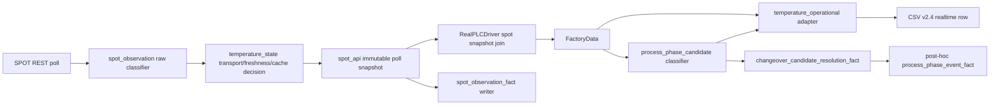

# spot-temperature-v2-4-operational-patch - Design Document

> Version: 1.1.1 | Date: 2026-06-25 KST | Status: Completed - implementation preconditions revised
> Level: Dynamic | Plan: docs/01-plan/features/spot-temperature-v2-4-operational-patch.plan.md
> Analysis Contract: docs/03-analysis/spot-temperature-v2-4-operational-patch.analysis.md iteration 6

---

## 1. Overview

### 1.1 Purpose

v2.3 SPOT temperature shadow instrumentation과 PR #65 `Handle SPOT range sentinels explicitly`의 sentinel 안전장치를 유지하면서, v2.4에서 운영 소비자가 사용할 명시적 temperature output status, realtime candidate, post-hoc confirmed fact 계약을 추가한다.

이번 설계는 구현 전 gap analysis의 조건부 승인 항목을 반영해 다음 경계를 고정한다.

- 센서 출력 상태: `valid`, `under_range`, `over_range`, `stale`, `source_error`, `startup_pending`, `unknown`.
- realtime 공정 맥락: `process_phase_candidate`만 기록한다.
- 사후 확정: future context가 필요한 phase/expectedness/changeover 확정은 fact table만 소유한다.
- 원인 판정: 물리 원인은 확정값이 아니라 `temperature_under_range_cause_candidate`와 evidence code로만 표현한다.
- 스키마 선택: v2.3/v2.4 schema version과 column 배열은 별도 상수로 유지하고 파일 open 시점에 active contract를 고정한다.
- lifecycle grain: candidate terminal outcome은 `changeover_candidate_resolution_fact`가 소유하고, confirmed phase interval은 `process_phase_event_fact`가 소유한다.

### 1.2 Design Goals

- #65 invariant를 회귀 기준선으로 고정한다.
- `6553.4/6553.5` 행은 기존 `Temperature`를 항상 blank로 유지한다.
- 기존 `Temperature_quality`와 신규 operational fields를 분리한다.
- `temperature_state.py`의 transport/freshness/cache 결정을 재사용하고 중복 구현하지 않는다.
- realtime candidate와 post-hoc confirmed fact를 분리한다.
- 하나의 CSV 파일 안에 schema version/header가 섞이지 않도록 feature flag 전환은 파일 rollover로 처리한다.
- v2.3과 v2.4 validator를 동시에 지원한다.

## 2. Architecture

### 2.1 Current Baseline

| Area | Current file | Baseline behavior |
|---|---|---|
| SPOT raw classification | `backend/FacilityData/spot_observation.py` | `6553.4/6553.5` decimal-equivalent sentinel classification |
| Transport/freshness/cache decision | `backend/FacilityData/temperature_state.py` | shadow status, value origin, cache reuse decision |
| SPOT poll snapshot | `backend/FacilityData/drivers/spot_api.py` | immutable snapshot, cache suppression after invalid sentinel |
| PLC composition | `backend/FacilityData/drivers/real_plc.py` | effective SPOT value만 `FactoryData.Spot`에 반영 |
| CSV writer | `backend/FacilityData/repository.py` | `Temperature` uses `data.Spot`; v2.3 shadow fields appended |
| Validator | `scripts/validate_csv_v2_shadow.py` | v2.3 sentinel and temperature origin invariants |
| Post-hoc process facts | `backend/FacilityData/process_state.py` | v2.3 source row mutation 없이 separate process segment fact 출력 |

### 2.2 Target Architecture



순환 논리를 막기 위해 phase와 expectedness의 입력 방향을 고정한다.

```text
PLC + Count + operator metadata
  -> process_phase_candidate

SPOT status + process_phase_candidate
  -> temperature_expectedness_candidate
```

`process_phase_candidate`는 SPOT temperature status를 입력으로 사용하지 않는다.

### 2.3 Component Design

| Component | Responsibility |
|---|---|
| `TemperatureOperationalInput` | normalized v2.3 shadow fields, row-time freshness, process candidate |
| `TemperatureOperationalDecision` | output status, unavailable reason, expectedness candidate, cause candidate/evidence |
| `derive_temperature_operational_fields` | `temperature_state.py` 결과를 운영 필드로 변환하는 pure adapter |
| `derive_process_phase_candidate` | future context 없는 realtime process candidate 산출 |
| `write_changeover_candidate_resolution_fact` | candidate당 정확히 하나의 terminal outcome fact 산출 |
| `infer_process_phase_events` | source CSV를 변형하지 않는 post-hoc confirmed interval/event fact 산출 |
| `write_spot_observation_fact` | immutable poll completion 시점에 idempotent observation fact 기록 |
| `validate_csv_v2_operational` | v2.4 operational invariant 검사 |

## 3. Data Model

### 3.1 CSV Schema Version and Rollover

v2.3과 v2.4는 동시에 지원해야 하므로 schema version과 column 배열을 분리한다.

```python
CSV_SCHEMA_VERSION_V2_3 = "2.3.0"
CSV_SCHEMA_VERSION_V2_4 = "2.4.0"

V2_3_CSV_COLUMNS = [
    ...
]

V2_4_OPERATIONAL_COLUMNS = [
    "temperature_output_status",
    "temperature_unavailable_reason",
    "temperature_expectedness_candidate",
    "temperature_under_range_cause_candidate",
    "temperature_cause_confidence",
    "temperature_cause_evidence_codes",
    "spot_effective_age_ms_at_row",
    "spot_effective_freshness_at_row",
    "spot_effective_value_age_ms_at_row",
    "spot_row_age_clock_status",
    "process_phase_candidate",
    "process_phase_rule_version",
    "phase_confirmation_state",
    "changeover_candidate_id",
    "spot_observation_key",
]

V2_4_CSV_COLUMNS = [
    *V2_3_CSV_COLUMNS,
    *V2_4_OPERATIONAL_COLUMNS,
]
```

`V2_CSV_COLUMNS`라는 단일 mutable 계약에 신규 컬럼을 직접 append하지 않는다. 기존 호출부 호환을 위해 alias가 필요하면 file-open 시점의 `active_columns`에서만 계산한다.

File-open contract:

1. 새 CSV 파일을 열 때 `CSV_V2_OPERATIONAL_FIELDS_ENABLED`를 한 번 읽는다.
2. `false`이면 `active_schema_version=2.3.0`, `active_columns=V2_3_CSV_COLUMNS`를 고정한다.
3. `true`이면 `active_schema_version=2.4.0`, `active_columns=V2_4_CSV_COLUMNS`를 고정한다.
4. 파일이 열린 뒤 flag, rule version, environment가 바뀌어도 현재 파일의 schema/header 계약은 변경하지 않는다.
5. flag 전환은 현재 파일 flush/close 후 새 파일 open으로만 반영한다.

```text
CSV_V2_OPERATIONAL_FIELDS_ENABLED=false
  -> schema 2.3.0 파일 유지

flag false -> true
  -> 기존 파일 flush/close
  -> 신규 2.4.0 파일 생성
  -> v2.4 header 및 metadata 기록

flag true -> false
  -> 기존 파일 flush/close
  -> 신규 2.3.0 파일 생성
```

Metadata must record `active_schema_version`, active column hash, operational flag state, temperature rule version, process phase rule version, and git commit. 같은 CSV 안에 `2.3.0` 행과 `2.4.0` 행이 섞이면 안 된다.

### 3.2 Realtime v2.4 Columns### 3.2 Realtime v2.4 Columns

새 컬럼은 `V2_4_OPERATIONAL_COLUMNS`로 정의하고 `V2_4_CSV_COLUMNS = V2_3_CSV_COLUMNS + V2_4_OPERATIONAL_COLUMNS`로만 노출한다.

| Column | Type | Allowed values | Source |
|---|---|---|---|
| `temperature_output_status` | enum | `valid`, `under_range`, `over_range`, `stale`, `source_error`, `startup_pending`, `unknown` | operational adapter |
| `temperature_unavailable_reason` | enum/blank | `under_range`, `over_range`, `stale_observation`, `timeout`, `connection_error`, `http_error`, `parse_error`, `empty_body`, `config_missing`, `numeric_out_of_range`, `not_attempted`, `startup_pending`, `unknown_freshness`, `unknown` | operational adapter |
| `temperature_expectedness_candidate` | enum/blank | `expected_candidate`, `unexpected_candidate`, `unknown`, blank | operational + process candidate |
| `temperature_under_range_cause_candidate` | enum/blank | `peak_picker_reset_candidate`, `target_out_of_fov_candidate`, `alignment_change_candidate`, `low_signal_candidate`, `below_measurement_range_candidate`, `unknown`, blank | diagnostics classifier |
| `temperature_cause_confidence` | float/blank | 0.0..1.0 | diagnostics classifier |
| `temperature_cause_evidence_codes` | text list/blank | stable evidence codes | diagnostics classifier |
| `spot_effective_age_ms_at_row` | float/blank | finite non-negative | monotonic row age |
| `spot_effective_freshness_at_row` | enum | `fresh`, `stale`, `unknown` | row freshness classifier |
| `spot_effective_value_age_ms_at_row` | float/blank | finite non-negative | monotonic value age |
| `spot_row_age_clock_status` | enum | `ok`, `clock_anomaly`, `unknown` | row clock classifier |
| `process_phase_candidate` | enum | `production_stable`, `setup_candidate`, `pre_changeover_hold_candidate`, `die_change_candidate`, `setup_alignment_candidate`, `changeover_candidate`, `idle_candidate`, `unknown` | process candidate classifier |
| `process_phase_rule_version` | text | deterministic version | process candidate classifier |
| `phase_confirmation_state` | enum | `realtime_candidate`, `unknown`, blank | realtime row only |
| `changeover_candidate_id` | text/blank | deterministic candidate id | process candidate classifier |
| `spot_observation_key` | text/blank | `{spot_service_instance_id}:{spot_poll_seq}` | SPOT snapshot |

Realtime CSV는 confirmed `changeover_event_id`를 소유하지 않는다.

### 3.3 Changeover Candidate Resolution Fact

`changeover_candidate_resolution_fact`는 candidate lifecycle의 terminal outcome을 소유한다. Grain은 `changeover_candidate_id`당 정확히 한 행이다.

| Column | Purpose |
|---|---|
| `candidate_resolution_schema_version` | fact schema version |
| `changeover_candidate_id` | realtime candidate key |
| `confirmation_outcome` | `confirmed`, `rejected`, `merged`, `split` 중 하나 |
| `resolved_at` | resolution timestamp |
| `resolution_rule_version` | deterministic rule version |
| `source_file_id` | source CSV SHA-256 |
| `logger_service_instance_id` | source logger identity |
| `sample_seq_start` / `sample_seq_end` | candidate evidence interval |
| `merged_into_changeover_event_id` | merge target when outcome is `merged` |
| `split_event_count` | split event count when outcome is `split` |
| `split_changeover_event_ids` | sorted JSON array of event ids when split |
| `resolution_reason` | bounded explainability code |
| `resolution_confidence` | bounded confidence |

Lifecycle invariant:

```text
count(changeover_candidate_resolution_fact where changeover_candidate_id = X) == 1
confirmation_outcome in confirmed/rejected/merged/split
```

A split still has one candidate-resolution row; multiple confirmed event rows are represented in `process_phase_event_fact` and linked through `source_changeover_candidate_id`.

### 3.4 Post-Hoc Process Phase Event Fact

`process_phase_event_fact`는 realtime CSV와 분리하며 confirmed interval/event를 소유한다. Grain은 confirmed process phase event당 한 행이다.

| Column | Purpose |
|---|---|
| `process_phase_event_schema_version` | fact schema version |
| `changeover_event_id` | confirmed deterministic event key |
| `source_changeover_candidate_id` | realtime candidate lineage |
| `source_file_id` | source CSV SHA-256 |
| `logger_service_instance_id` | source logger identity |
| `sample_seq_start` / `sample_seq_end` | interval |
| `phase_start_at` / `phase_end_at` | interval timestamps |
| `process_phase_confirmed` | `setup`, `setup_alignment`, `pre_changeover_hold`, `die_change`, `changeover`, `production_stable`, `idle`, `unknown` |
| `temperature_expectedness_confirmed` | `expected`, `unexpected`, `indeterminate` |
| `phase_confirmation_state` | `posthoc_confirmed`, `posthoc_rejected`, `posthoc_merged`, `posthoc_split` |
| `confirmation_rule_version` | deterministic rule version |
| `confirmation_reason` | explainability |
| `confirmation_confidence` | bounded confidence |

Candidate-to-confirmed mapping:

```text
setup_candidate               -> setup
setup_alignment_candidate     -> setup_alignment
pre_changeover_hold_candidate -> pre_changeover_hold
die_change_candidate          -> die_change
changeover_candidate          -> changeover
production_stable             -> production_stable
idle_candidate                -> idle
unknown                       -> unknown
```

If a downstream consumer cannot accept the expanded confirmed enum, compatibility mapping must be explicit at export time; the canonical v2.4 fact keeps the expanded enum above.

### 3.5 Observation Fact Columns

`spot_observation_fact`는 SPOT poll당 한 행을 poll 완료 시점에 기록한다.

Primary key:

```text
spot_service_instance_id
spot_poll_seq
```

| Column | Purpose |
|---|---|
| `spot_observation_fact_schema_version` | fact schema version |
| `spot_observation_key` | `{spot_service_instance_id}:{spot_poll_seq}` |
| `spot_service_instance_id` | service identity |
| `spot_poll_seq` | poll sequence |
| `spot_observation_seq` | snapshot sequence |
| `spot_poll_status` | poll status |
| `spot_raw_validity` | raw validity |
| `spot_device_status_code` | `temperature_under_range`, `temperature_over_range`, blank |
| `spot_temperature_raw` | bounded raw text |
| `spot_raw_payload_hash` | raw payload hash |
| `spot_error_code` | normalized poll/parser error code |
| `spot_http_status_code` | upstream HTTP status |
| `spot_response_length_bytes` | bounded response length |
| `spot_raw_payload_truncated` | raw payload truncation flag |
| `spot_raw_payload_encoding` | detected or configured encoding |
| `spot_last_poll_started_at` / `completed_at` | poll timing |
| `spot_poll_duration_ms` | duration |
| `diagnostics_captured_at` | diagnostic snapshot timestamp |
| `diagnostics_capture_status` | `same_response`, `async_enriched`, `missing`, `error` |
| `diagnostics_age_ms` | diagnostic age relative to poll completion |
| `alarmstatus` | AMETEK alarm status |
| `signalpc` | signal percent |
| `d1temperature` / `d2temperature` | detector diagnostics |
| `e1out` / `e2out` | emissivity outputs |
| `appnumber` | AMETEK app number |
| `instrument_info` | bounded instrument metadata |
| `peak_picker_enabled` | Peak Picker enabled state |
| `peak_picker_threshold` | Peak Picker threshold |
| `peak_picker_off_delay_ms` | Peak Picker off delay |
| `peak_picker_off_mode` | Peak Picker off mode |
| `actuator_position` | actuator position |
| `actuator_scan_state` | actuator scan state |
| `actuator_peak_found` | actuator peak found state |

Additional REST calls for diagnostics must not delay the SPOT poll critical path. Diagnostics may be captured from the same response, or added by asynchronous enrichment with `diagnostics_capture_status=async_enriched` and bounded `diagnostics_age_ms`.

Writer failure must not stop SPOT polling. Implement failure counters and retry/local spool behavior.

## 4. Decision Rules## 4. Decision Rules

### 4.1 Temperature Output Decision Table

Raw SPOT classification and row-time operational status are separate. `spot_device_status_code` preserves the latest raw observation, while `temperature_output_status` answers whether the current realtime CSV row may use that observation.

Operational precedence:

```text
startup / clock anomaly
-> row-time stale
-> fresh sentinel
-> fresh transport/source error
-> fresh valid or explicitly allowed cache
-> unknown
```

| Condition | `Temperature` | `temperature_output_status` | `temperature_unavailable_reason` | Origin |
|---|---|---|---|---|
| startup before first poll | blank | `startup_pending` | `startup_pending` | `none` |
| negative age / clock anomaly | blank | `unknown` | `unknown_freshness` | `none` |
| row age exceeds threshold | blank | `stale` | `stale_observation` | `none` |
| fresh `spot_device_status_code=temperature_under_range` | blank | `under_range` | `under_range` | `none` |
| fresh `spot_device_status_code=temperature_over_range` | blank | `over_range` | `over_range` | `none` |
| fresh timeout | blank | `source_error` | `timeout` | `none` |
| fresh connection error | blank | `source_error` | `connection_error` | `none` |
| fresh HTTP error | blank | `source_error` | `http_error` | `none` |
| fresh parse error / malformed | blank | `source_error` | `parse_error` | `none` |
| fresh empty body | blank | `source_error` | `empty_body` | `none` |
| fresh config missing | blank | `source_error` | `config_missing` | `none` |
| fresh numeric out of range, non-sentinel | blank | `source_error` | `numeric_out_of_range` | `none` |
| fresh valid temperature | finite value | `valid` | blank | `current_observation` |
| fallback-eligible cached temperature | finite value | `valid` | blank | `cached_observation` |
| not attempted | blank | `unknown` | `not_attempted` | `none` |
| unknown freshness | blank | `unknown` | `unknown_freshness` | `none` |
| missing unknown | blank | `unknown` | `unknown` | `none` |

If the last raw observation was `6553.4` and the row age is stale, the row keeps `spot_device_status_code=temperature_under_range`, but emits `temperature_output_status=stale` and `temperature_unavailable_reason=stale_observation`. This prevents an old sentinel from being interpreted as the current operational state.

### 4.2 Expectedness Candidate Rules

Realtime expectedness is candidate-only.

| Input | `temperature_expectedness_candidate` |
|---|---|
| `temperature_output_status=under_range` + `process_phase_candidate` in setup/pre-changeover/die-change/setup-alignment candidates | `expected_candidate` |
| `temperature_output_status=under_range` + `production_stable` | `unexpected_candidate` |
| `temperature_output_status=over_range` in any phase | `unexpected_candidate` |
| `temperature_output_status` in `stale`, `source_error`, `startup_pending`, `unknown` | `unknown` |
| phase unknown | `unknown` |
| temperature valid | blank |

Blank means no expectedness claim is needed for a valid temperature. `unknown` means a temperature unavailable/error state exists but realtime context is insufficient or non-fresh.

Final expected/unexpected/indeterminate is written only to post-hoc fact as `temperature_expectedness_confirmed`.

### 4.3 Under-Range Cause Candidate Rules

`temperature_under_range_cause_candidate` must remain conservative.

- Default: `unknown`.
- `peak_picker_reset_candidate` only when `peak_picker_off_mode_reset_configured` evidence is present.
- `target_out_of_fov_candidate` only when actuator/camera evidence supports it.
- `alignment_change_candidate` only when actuator scan/change evidence supports it.
- `low_signal_candidate` only when signal diagnostic evidence supports it.
- `below_measurement_range_candidate` only when configured range and process evidence support it.
- No final non-candidate physical cause is allowed in this patch.

Evidence codes are stable identifiers serialized in CSV as a sorted JSON array string. Blank means no evidence was evaluated; `[]` means evaluated with no supporting code.

Initial evidence codes:

```text
phase_setup_candidate
actuator_scanning
signal_below_threshold
alarm_low_signal
peak_picker_off_mode_reset_configured
```

When multiple cause candidates are supported, choose the highest-priority candidate in this order and keep all supporting evidence codes:

```text
peak_picker_reset_candidate
-> target_out_of_fov_candidate
-> alignment_change_candidate
-> low_signal_candidate
-> below_measurement_range_candidate
-> unknown
```

`temperature_cause_confidence` must be deterministic from evidence strength and bounded to `0.0..1.0`; no candidate may exceed `0.9` without at least one direct equipment diagnostic code.

### 4.4 Row Freshness and Clock Rules### 4.4 Row Freshness and Clock Rules

Row-time freshness uses same-process monotonic time.

```text
spot_effective_age_ms_at_row = row_created_monotonic - poll_completed_monotonic
```

Rules:

```text
age <= freshness_threshold_ms -> fresh
age > freshness_threshold_ms  -> stale
negative age                  -> unknown + clock_anomaly
poll completion missing       -> unknown
```

CSV stores the computed result and relevant UTC timestamps; the freshness decision itself must not depend on wall-clock deltas when monotonic timing is available.

### 4.5 Process Phase Candidate Rules

Realtime phase is candidate-only and cannot use SPOT status as an input. Rules may use only current-row values and earlier observed state.

| Condition | `process_phase_candidate` |
|---|---|
| Count in 0..2 and low speed/press | `setup_candidate` |
| Count > 2, recent production motion exists, currently stopped, Speed/MainPress/BilletLength are stopped, and Count is held for the configured duration | `pre_changeover_hold_candidate` |
| current row has operator-entered die/mold change marker or mold id differs from the last committed operator context while stopped | `die_change_candidate` |
| product or mold context transition is already observed at or before the current row while stopped | `changeover_candidate` |
| actuator scan/alignment evidence while stopped | `setup_alignment_candidate` |
| sustained extruding | `production_stable` |
| idle low speed/press without setup evidence | `idle_candidate` |
| insufficient context | `unknown` |

`pre_changeover_hold_candidate` must not look ahead to a later Count reset or future 품번/금형 변경. Later Count reset or product/mold change may only be used by post-hoc facts to confirm `pre_changeover_hold`.

Candidate-to-confirmed mapping is fixed in Section 3.4 and must be covered by tests.

## 5. API Specification## 5. API Specification

No new write/control API is required for P0.

Read-only health/status exposure may include aggregate operational diagnostics only:

- rows by `temperature_output_status`.
- rows by `temperature_unavailable_reason`.
- sentinel counts by `spot_device_status_code`.
- stale threshold breach count.
- observation fact write failures.
- observation fact link failures.
- process phase candidate counts.

Security constraints:

- Do not expose SPOT URLs or local executable paths in user-facing API responses.
- Do not include raw body text in health summaries.
- CSV text fields must use existing CSV formula escaping.
- Unknown enum values should be rejected or normalized, not passed through silently.

## 6. Implementation Plan

### 6.1 File Structure

Planned files:

```text
backend/FacilityData/temperature_operational.py
backend/FacilityData/process_phase.py
backend/FacilityData/changeover_candidate_resolution_fact.py
backend/FacilityData/spot_observation_fact.py
scripts/infer_process_phase_events_for_csv.py
scripts/validate_csv_v2_shadow.py
backend/tests/test_temperature_operational.py
backend/tests/test_process_phase.py
backend/tests/test_changeover_candidate_resolution_fact.py
backend/tests/test_spot_observation_fact.py
backend/tests/test_csv_v2_4_operational_contract.py
```

Existing files to modify:

```text
backend/FacilityData/schemas.py
backend/FacilityData/repository.py
backend/FacilityData/drivers/real_plc.py
backend/FacilityData/drivers/spot_api.py
backend/FacilityData/process_state.py
backend/tests/test_spot_api.py
backend/tests/test_spot_observation.py
backend/tests/test_real_plc.py
```

### 6.2 Implementation Order

1. Freeze enum precedence, candidate/confirmed naming, ID lifecycle, row-age clock, schema rollover, and metadata.
2. Split repository schema constants into `CSV_SCHEMA_VERSION_V2_3`, `CSV_SCHEMA_VERSION_V2_4`, `V2_3_CSV_COLUMNS`, `V2_4_OPERATIONAL_COLUMNS`, and `V2_4_CSV_COLUMNS`.
3. Implement `temperature_operational.py` as an adapter over `temperature_state.py`.
4. Implement `process_phase_candidate` classifier without SPOT status input or future context.
5. Add `FactoryData` fields and active-schema-aware v2.4 CSV columns.
6. Implement atomic schema rollover for `CSV_V2_OPERATIONAL_FIELDS_ENABLED` transitions.
7. Implement `spot_observation_fact.py` with diagnostics, idempotency, failure counter, retry/spool, and polling failure isolation.
8. Implement `changeover_candidate_resolution_fact.py` so every candidate reaches one terminal outcome.
9. Implement `infer_process_phase_events_for_csv.py` for post-hoc confirmation event facts.
10. Extend validator and operational observability counters.
11. Add synthetic tests for all decision-table branches.
12. Run source CSV replay and downstream compatibility checks before report or operational promotion.

## 7. Test Plan## 7. Test Plan

### 7.1 Unit and Contract Tests

- all `temperature_output_status` enum branches.
- all `temperature_unavailable_reason` enum branches.
- all cache/value-origin combination invariants.
- `6553.4`, `6553.40`, CRLF/whitespace -> under_range.
- `6553.5`, `6553.50` -> over_range.
- nearby non-sentinel values -> numeric out-of-range, not sentinel.
- sentinel rows produce blank `Temperature`.
- invalid sentinel suppresses pre-sentinel cache until next valid temperature.
- stale, timeout, connection error, HTTP error, empty body, parse error, config missing, not attempted, startup, unknown freshness.
- negative row age maps to `spot_row_age_clock_status=clock_anomaly`.
- process phase candidate does not use SPOT status.
- expectedness candidate uses SPOT status plus process phase candidate.

Required sentinel/cache regression sequence:

```text
valid -> 6553.4 -> timeout -> timeout -> valid
```

The two timeout rows must not reuse the earlier valid temperature.

### 7.2 Integration Tests

- Generated v2.4 row contains new append-only fields.
- `CSV_V2_OPERATIONAL_FIELDS_ENABLED` transition closes the current file and creates a new schema-versioned file.
- A file-open active contract does not change after flag or rule-version changes.
- v2.4 metadata contains operational rule versions, active schema version, active column hash, feature flag state, freshness threshold, source schema version, and git commit.
- v2.3 docs/data CSV files still validate.
- synthetic v2.4 CSV validates operational invariants.
- observation fact has zero duplicate `{spot_service_instance_id, spot_poll_seq}` keys.
- realtime nonblank `spot_observation_key` links to exactly one fact row when `SPOT_OBSERVATION_FACT_ENABLED=true`.
- fact writer failure does not stop SPOT polling.
- post-hoc script writes resolution and event facts without mutating source CSV.
- every `changeover_candidate_id` has exactly one row in `changeover_candidate_resolution_fact`.
- split candidates have one resolution row and one or more linked `process_phase_event_fact` rows.
- promotion bundle requires `CSV_V2_OPERATIONAL_FIELDS_ENABLED=true`, `SPOT_OBSERVATION_FACT_ENABLED=true`, and `PROCESS_PHASE_EVENT_FACT_ENABLED=true` together.

### 7.3 Evidence Replay### 7.3 Evidence Replay

Replay checks should reproduce the existing dataset observations and add v2.4 assertions:

- 109,010 total rows.
- 92,582 valid temperature rows.
- 16,428 under-range rows.
- 0 over-range rows.
- 22,275 unique polls.
- 3,573 unique under-range polls.
- 0 invalid sentinel rows with nonblank `Temperature`.
- 0 origin-none rows with nonblank `Temperature`.
- 530 `available_not_used` rows.
- 0 `reused` rows.
- zero observation key duplicates in fact output.
- zero realtime/fact link failures.

## 8. Operational Rollout

| Flag | Default | Purpose |
|---|---:|---|
| `CSV_V2_OPERATIONAL_FIELDS_ENABLED` | false during initial rollout | emit v2.4 operational fields with file rollover as part of the full promotion bundle |
| `CSV_V2_LEGACY_TEMPERATURE_QUALITY_PROMOTION_ENABLED` | false | allow legacy `Temperature_quality` semantic switch after P3 |
| `SPOT_OBSERVATION_FACT_ENABLED` | false | emit per-poll fact table only as part of the full promotion bundle |
| `PROCESS_PHASE_EVENT_FACT_ENABLED` | false | gate `scripts/infer_process_phase_events_for_csv.py`; enabled only as part of the full promotion bundle |

Rollout stages:

| Stage | Allowed state | Promotion criteria |
|---|---|---|
| P0 | default-off only; collect v2.3 evidence with all v2.4 promotion flags false | #65 regression, no CSV schema change by default, partial promotion flag combinations rejected at runtime |
| P1 | enable the full v2.4 promotion bundle in controlled environment | schema atomicity, v2.3/v2.4 validators, synthetic decision coverage, health aggregate counters |
| P2 | validate observation and process facts with v2.4 CSV under the full bundle | link coverage, observation uniqueness, lifecycle resolution integrity |
| P3 | optional legacy `Temperature_quality` semantic promotion | downstream compatibility and rollback drill complete |

Operational promotion bundle:

```text
CSV_V2_OPERATIONAL_FIELDS_ENABLED=true
SPOT_OBSERVATION_FACT_ENABLED=true
PROCESS_PHASE_EVENT_FACT_ENABLED=true
```

The only allowed runtime states are all three promotion flags disabled or all three enabled together. Partial promotion flag combinations are rejected during backend config import, including fact-only experiments such as `SPOT_OBSERVATION_FACT_ENABLED=true` without the other two flags. CLI/fact smoke tests that exercise v2.4 facts must set the full bundle in a controlled environment.

Rollback:

- Disable v2.4 operational fields and roll over to a new v2.3 file.
- Keep #65 sentinel logic unchanged.
- Do not rewrite historical CSV.
- Consumers can ignore appended v2.4 columns or pin to schema `2.3.0`.

## 9. Report Readiness Gates

Match rate alone is not sufficient for report or operational promotion.

| Required gate | Completion evidence |
|---|---|
| Schema atomicity | one CSV file contains exactly one schema version, one matching header, and one file-open active column contract |
| Sentinel invariant | all `6553.4` / `6553.5` rows have blank `Temperature` |
| Cache suppression | after sentinel, timeout rows do not reuse the previous valid temperature before a new valid poll |
| Stale precedence | stale rows preserve raw `spot_device_status_code` but emit `temperature_output_status=stale` |
| Observation uniqueness | observation fact has zero duplicate `{spot_service_instance_id, spot_poll_seq}` keys |
| Link coverage | when the promotion bundle is enabled, each realtime nonblank `spot_observation_key` links to exactly one fact row |
| Candidate lifecycle integrity | every `changeover_candidate_id` has exactly one terminal row in `changeover_candidate_resolution_fact` and no orphan event rows |
| Split grain integrity | split candidates have one resolution row and multiple linked event rows only when needed |
| Failure isolation | fact writer failure does not stop SPOT polling |
| Future-context isolation | realtime candidate logic does not use later Count reset or product/mold changes |
| Compatibility | v2.3 and v2.4 validator plus downstream consumer checks pass |
| Controlled tests | all status/reason branches and cache/value-origin invariants pass |

## 10. Security and Failure Modes## 10. Security and Failure Modes

- No credentials or tokens are added.
- No device control write is introduced.
- Raw SPOT URLs remain out of health/user-facing responses.
- Raw payload body remains bounded and should move to observation fact for long-term storage.
- CSV formula injection protection applies to all new text fields.
- Enum validation rejects unexpected operational state text.
- Missing config diagnostics keeps under-range cause candidate at `unknown`.
- SPOT service restart changes service instance and prevents key collision.
- Logger restart preserves row key boundary through logger instance metadata.

## 11. References

- `docs/01-plan/features/spot-temperature-v2-4-operational-patch.plan.md`
- `docs/03-analysis/spot-temperature-v2-4-operational-patch.analysis.md`
- `docs/04-report/spot-temperature-final-report/SPOT_Temperature_Report.html`
- `docs/04-report/spot-temperature-final-report/source_note.json`
- `docs/04-report/spot-temperature-state-labeling.report.md`
- `backend/FacilityData/spot_observation.py`
- `backend/FacilityData/temperature_state.py`
- `backend/FacilityData/drivers/spot_api.py`
- `backend/FacilityData/drivers/real_plc.py`
- `backend/FacilityData/repository.py`
- `backend/FacilityData/process_state.py`
- `scripts/validate_csv_v2_shadow.py`
- PR #65 commit `95b55f5 Handle SPOT range sentinels explicitly`